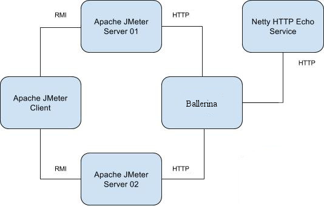

# Artifacts for Ballerina Performance Tests

The package (**performance-ballerina-distribution-${version}.tar.gz**) built by the distribution maven module is the
 package required for Ballerina performance tests from this repository.

The following scenarios are covered with this ballerina performance testing package

- passthrough.bal
- http_passthrough.bal

The (**performance-common-distribution-${version}.tar.gz**) package is also required for performance tests.

The scripts in this repository depend on the scripts in
 "[performance-common](https://github.com/wso2/performance-common/)" repository.

This package must be extracted in user home directory of the JMeter node and the Ballerina node used for the
 performance tests.

In addition, please make sure to extract the "performance-common" package to all nodes and install Java, JMeter, and SAR to all nodes by using scripts provided.

Following is the deployment diagram of the setup



### Steps to run performance tests

Following are the high-level steps to run the performance tests.

- Copy the performance-ballerina and performance-common packages to all servers.
- Build the above packages and copy the xx.tar to the home directory and extract it.
- Extract the packages in user home directory
- Download latest Oracle JDK 8 to all servers.
- Download latest Apache JMeter to all JMeter servers.
- Download Ballerina distribution to Balleirna server.
- Install Java in all servers using the install-java.sh script inside java directory.
- Install 'System Activity Report' in all servers using the install-sar.sh script inside sar directory.
-  Install 'Apache JMeter' in all JMeter servers using the install-jmeter.sh script inside jmeter directory
- Setup Ballerina in the ballerina server using **_setup.sh_** script inside *ballerina-scripts* directory.
- Run the performance test using **_run-performance-test.sh_** script inside the *jmeter-scripts* directory.
- Use create-summary-csv.sh to generate a summary.csv file from the test results.
- Use Python scripts (create-charts.py and create-comparison-charts.py) to generate charts from the summary results.


See following sections for more details.

### Ballerina

The "ballerina-scripts" directory has the scripts related to Ballerina and the configurations. These scripts must be run in
 Ballerina node.

Following sections have more details about each script.

#### setup.sh

The `setup.sh` script is the only script you need to run to set up and configure Ballerina and the netty host mapping. A ballerina distribution
 should be copied to the home directory of the Ballerina node. This script will extract the distribution and copy the
 bal files that will be used to do the performance tests. The name of the ballerina distribution and the ip of the netty server should be given as
 parameters.
 
 
How to run:

`./setup.sh ballerina-runtime-0.970.0 192.168.1.1`

#### ballerina-start.sh

This script starts the given Ballerina service with the given Java heap size and given flags

How to run:

`./ballerina-start.sh 1G passthrough.bal -e b7a.http.tracelog.console=true`

### Apache JMeter

Inside "jmeter-scripts", directory there are two scripts to run the performance tests and create a summary CSV from the JMeter
 results.
 
#### Setup pre-Requisits for Jmeter
For Jmeter 4.0 it is required to [setup SSL](http://jmeter.apache.org/usermanual/remote-test.html#setup_ssl) . Copy the `rmi_keystore.jks` to all the jmeter client and server nodes.

However, it is also possible the disbale the secure communication between the client and server node by adding the following property to "user.properties" of all the jmeter packs.

```
server.rmi.ssl.disable=true
```


#### run-performance-test.sh

The `run-performance-test.sh` script runs the performance tests for different test scenarios. This script must be used
 in the JMeter node

This script is using ssh config to connect with other nodes from JMeter client and get server metrics and log files.
 Therefore, it is important use a configuration as follows in `~/.ssh/config`

```
Host ballerina
    HostName x.x.x.1
    User ubuntu
    IdentityFile /home/ubuntu/ballerina.pem

Host netty
    HostName x.x.x.2
    User ubuntu
    IdentityFile /home/ubuntu/ballerina.pem

Host jmeter1
    HostName x.x.x.3
    User ubuntu
    IdentityFile /home/ubuntu/ballerina.pem

Host jmeter2
    HostName x.x.x.4
    User ubuntu
    IdentityFile /home/ubuntu/ballerina.pem

```

There are multiple parameters inside the script and the values should be changed as required.

 Parameter | Description
------------ | -------------
message_size | The different number of message sizes (payloads) in Bytes. This is an array.
concurrent_users | The different number of concurrent users. This an array and the brackets are important.
ballerina_files | The different ballerina files to be run. This is an array.
ballerina_flags | The different environment parameters to configure the ballerina service.
ballerina_flags_name | The symbolic name given to each ballerina_flag. The array size must be same as the ballerina_flags array.
ballerina_heap_size | The heap size to be used to run the ballerina service.
ballerina_host | The hostname or IP of the Ballerina node.
api_path | The api path of the ballerina service to which requests should be sent.
ballerina_ssh_host | The ssh host for the Ballerina node.
test_duration | Duration of the test in seconds.
warmup_time | The warmup time in minutes. This is used for JTL Splitter, which is from `performance-common`

After changing parameters, the performance tests can be started from the script in the JMeter node.
 It's recommended to run the tests in `nohup` mode.

For example:

`nohup ./run-performance-test.sh > test.out 2>&1 &`

The results of performance tests will be saved in `results` directory.

#### create-summary-csv.sh

After the performance tests are completed, a summary CSV for all results can be created using this script file.

The script expects the [GCViewer](https://github.com/chewiebug/GCViewer) jar file to analyze GC logs. The latest
 GCViewer JAR file can be downloaded from [Maven](http://repo1.maven.org/maven2/com/github/chewiebug/gcviewer/)

Copy the script inside the results directory before running.

How to run:

`./create-summary-csv.sh /path/to/gcviewer*.jar`

This will summarize the JTL file summary, ballerina gc logs and load average details in to file named **summary.csv**. 

GC and load average information about the netty service and jmeter setup can be summarized as below.

`./create-summary-csv.sh /path/to/gcviewer*.jar true`


#### Create charts

Use the given python scripts to generate the charts using the above obtained sumary results. The "Python" scripts uses following modules to visualize data.

- pandas
- matplotlib
- seaborn


Install these packages to python. These scripts were verified in python 3.6 version. 

Also if the python scripts are executed in the server environment include the following line at the top of the python scripts as it is requred to restrict Matplotlib using Xwindows as the backend when generating the charts.

```
import matplotlib
matplotlib.use('Agg')
```

Copy the 'ballerinachart.py' and 'create-charts.py' file inside the results directory and execute the python script.

`python create-charts.py`

